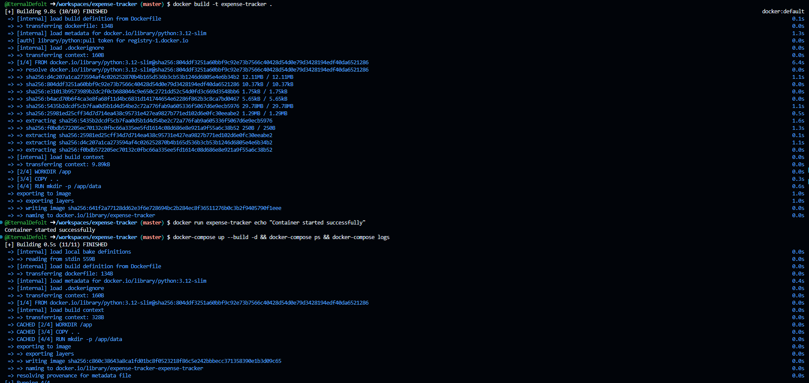
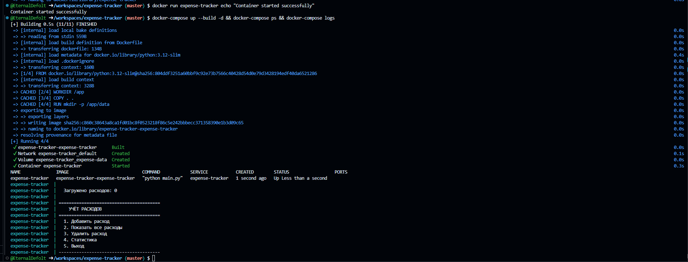

# Expense Tracker

Консольное приложение для учёта личных расходов на Python.

## Возможности

- Добавление расходов с указанием суммы, категории и описания
- Просмотр всех расходов в виде таблицы
- Удаление записей
- Статистика: общая сумма, расходы по категориям, по месяцам
- Сохранение данных в JSON-файл

## Запуск

### Локально

```bash
python main.py
```

### Docker

```bash
docker build -t expense-tracker .
docker run -it expense-tracker
```

### Docker Compose

```bash
docker-compose up --build
docker-compose down
```

## Структура проекта

```
├── main.py              # Точка входа, CLI-меню
├── expense.py           # Модель расхода и менеджер расходов
├── storage.py           # Сохранение/загрузка данных (JSON)
├── stats.py             # Статистика и отчёты
├── data/                # Директория для хранения данных
├── Dockerfile           # Образ Docker
├── .dockerignore        # Исключения для Docker
├── docker-compose.yml   # Docker Compose конфигурация
└── README.md
```

## Категории расходов

- Еда
- Транспорт
- Развлечения
- Здоровье
- Одежда
- Образование
- Другое

## Скриншоты Docker

### Сборка образа и запуск контейнера



### Docker Compose



## Автор

EternalDefolt
